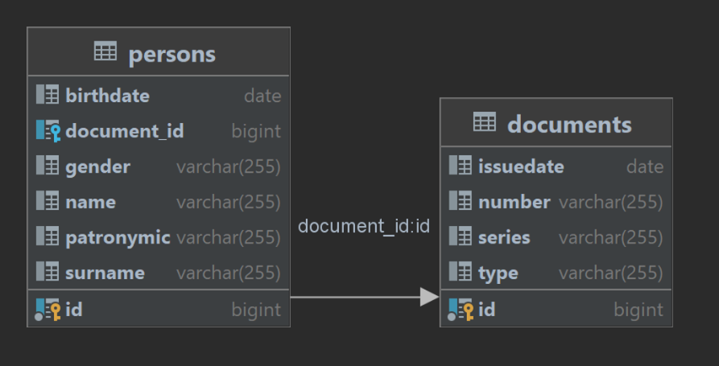
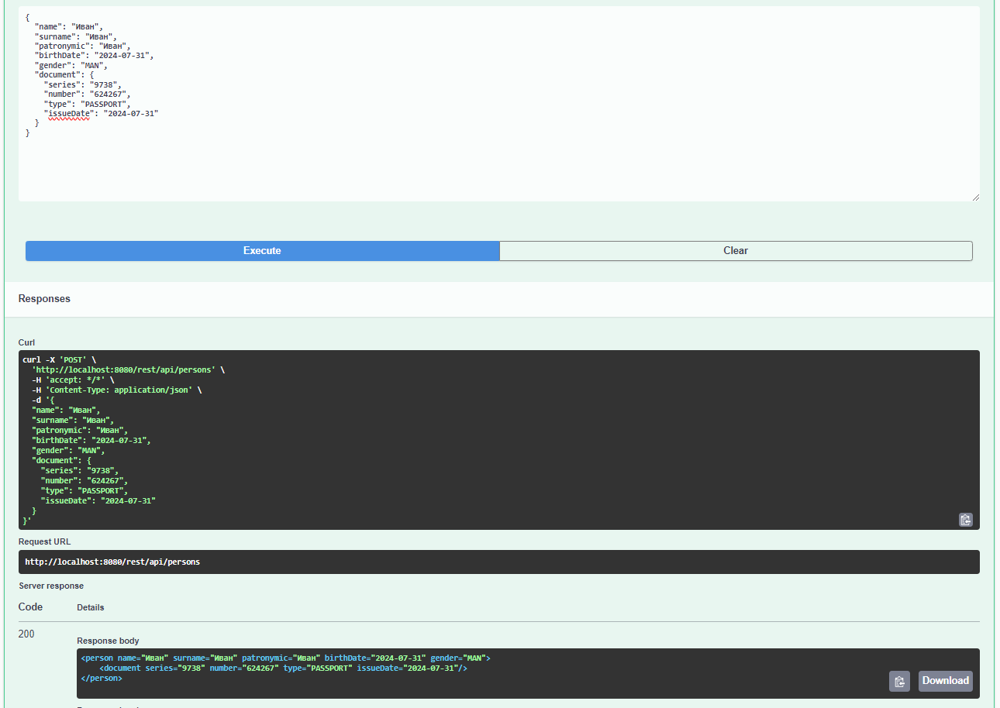

# axiomatic-test

## Техническое задание:
Необходимо разработать сервис по преобразованию JSON в XML шаблонизируемым путем.
Сам сервис должен состоять из двух приложений, которые будут взаимодействовать друг с другом:

**REST-приложение, обладает следующим функционалом:**
* POST метод принимающий JSON объект
* Сохранения данных в БД
* Преобразование JSON в XML (с помощью org.json)
* Взаимодействие с SOAP-приложением

**Стек технологий REST-приложения:**
* Spring boot
* Hibernate
* PostgreSQL
* Apache HttpClient
* Swagger
* org.json

**SOAP-приложение, обладает следующим функционалом:**
* SOAP метод принимающий данные в CDATA
* Парсинг XML
* Преобразование структуры XML при помощи XSLT

**Стек технологий SOAP-приложения:**
* Spring boot
* Spring WS
* XSLT
* W3C

**Общее описание как должен работать сервис:**
Начальной точкой является REST-приложение, в него подается JSON (пример далее по тексту), который сохраняется в БД, далее преобразует JSON в XML и отправляет данные в SOAP-приложение. Далее SOAP-приложение преобразует XML с помощью XSLT (именно в XSLT необходимо преобразовывать данные) и возвращается в ответ. После получения данных REST-приложением в БД сохраняется ответ и возвращается пользователю. Методы обоих приложений синхронные. Также необходимо добавить в корень REST проекта файл с названием AXITEST.MD, внутри указать используемую версию библиотеки hibernate-core.

**Пример входного JSON REST-приложения:**

    {
    "name": "Тест",
    "surname": "Тестов",
    "patronymic": "Тестович",
    "birthDate": "1990-01-01",
    "gender": "MAN", -- enum (MAN, WOMAN)
    "document": {
            "series": "1333",
            "number": "112233",
            "type": "PASSPORT", -- enum (PASSPORT, INTERNATIONAL_PASSPORT, DRIVER)
            "issueDate": "2020-01-01" -- Дата выдачи документа
        },
    }

**Входные данные SOAP-приложения:**

    <person>
        <name>Тест</name>
        <surname>Тестов</surname>
        <patronymic>Тестович</patronymic>
        <birthDate>1990-01-01</birthDate>
        <gender>MAN</gender>
        <document>
            <series>1333</series>
            <number>112233</number>
            <type>PASSPORT</type>
            <issueDate>2020-01-01</issueDate>
        </document>
    </person>

**Что ожидается на выходе:**
    
    <person name="Тест" surname="Тестов" patronymic="Тестович" birthDate="01.01.1990" gender="MAN">
        <document series="1333" number="112233" type="PASSPORT" issueDate="01.01.2020"/>
    </person>

## Схема БД PostgreSQL:

## Как развернуть и запустить:
1. Клонируйте репозиторий:
    $ git clone https://github.com/Telanors/axiomatic-test.git
2. Выполни чистую компиляцию SOAP-модуля:
    $ mvn clean compile -pl soap
3. Запусти SOAP-модуль
4. Выполни чистую компиляцию REST-модуля:
    $ mvn clean compile -pl rest
5. Запусти REST-модуль

## Результат работы:

Видео: https://disk.yandex.ru/i/XN09g22by6liGw